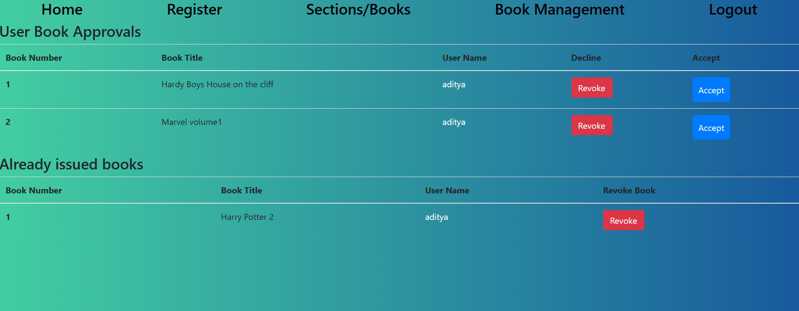
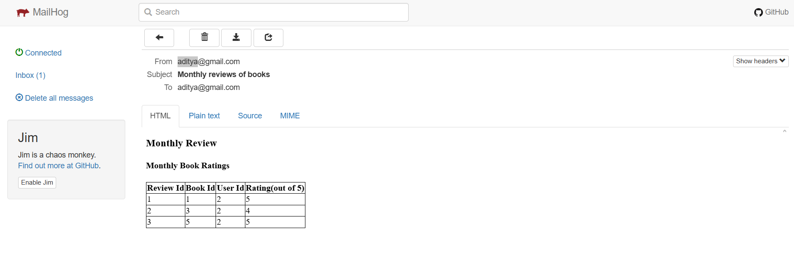
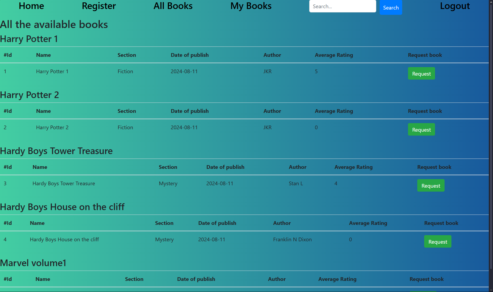
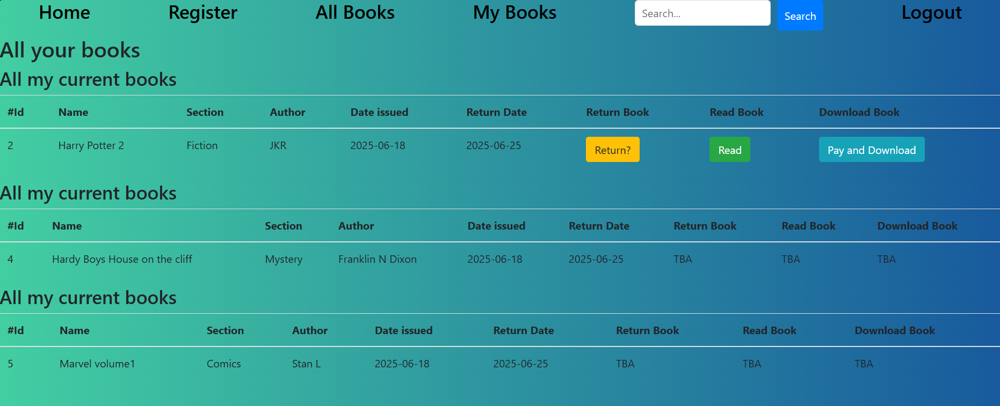
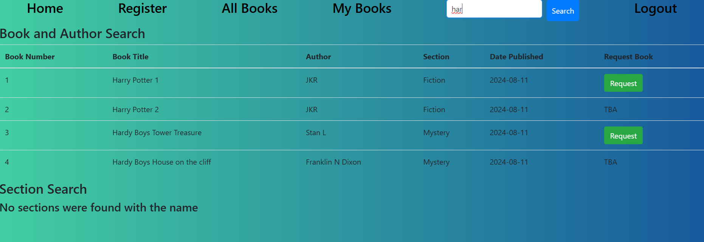
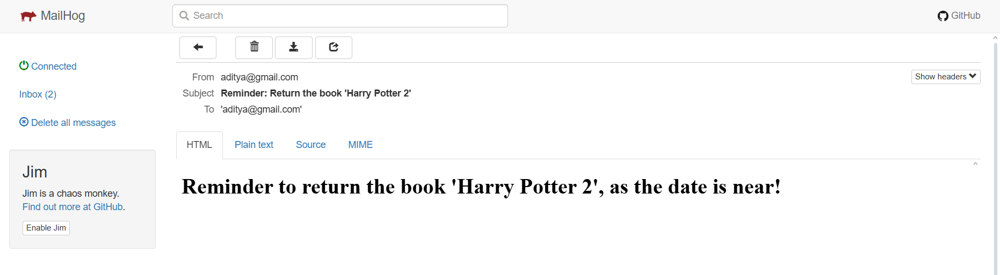

# 📚 Library Management System - V2 (LMS-v2-MAD2)

A modern and efficient Library Management System built using JavaScript. Version 2 introduces email reminders (via MailHog), monthly admin reports, and a paid PDF download feature. Designed for streamlined, automated library operations.
 It was made for the course 'Modern Application Development 2', which is part of the IIT Madras BS Degree in data Science.

## 🚀 Features

- 📖 Add, update, and delete books
- 👤 Manage student/user records
- 📅 Issue and return books with date tracking
- 📬 **Automated email reminders** for overdue books using MailHog
- 📈 **Monthly reports** sent to librarian/admin via email
- 🔍 Advanced search functionality for books and users
- 💾 Data persistence using **localStorage**
- 💳 **Download books in PDF format** for a fee (simulated payment system)
- ⬇️ Admin can download library data in **csv format**
- 🧹 Clean, modular, and intuitive UI design with Version 2 improvements

---

## 🛠️ Tech Stack

- **Frontend:** HTML, CSS, JavaScript(VueJS)
- **Backend:** Python (Flask, SQLAlchemy, Celery)
- **Database:** SQLite3
- **Task Queue:** Celery + Redis
- **Email Service:** MailHog (for local testing)

---

## 📸 Screenshots

| Admin HomePage | Admin Book Management | Monthly report in Mail |
|----------|------------|-----------|
|  |  |  |

| User HomePage | User's Books | Search Function | Reminder to user in Mail |
|----------|------------|-----------|-----------|
|  |  |  |  |


---

## 📂 Project Structure

```bash
LMS-V2-MAD2/
├── instance/
│   └── data.sqlite3               # SQLite database file
├── screenshots/                   # App screenshots for README
├── static/
│   ├── components/                # Reusable JS components
│   ├── pages/                     # Page-specific JS logic
│   ├── utils/                     # Utility functions (e.g., search)
│   ├── app.js                     # Main JavaScript logic
│   └── styles.css                 # Main stylesheet
├── templates/
│   └── index.html                 # Main HTML template (served by Flask)
├── user-downloads/               # Folder for storing downloadable PDFs
├── app.py                        # Flask app entry point
├── celeryconfig.py               # Celery configuration for background tasks
├── create_initial_data.py        # Script to populate initial DB data
├── Database Requirements.txt     # Requirements/spec for database structure
├── Entity Relationship diagram.jpeg  # ER diagram for database design
├── extensions.py                 # App-wide extensions (e.g., DB, mail)
├── Library_Management_System_V2_Report.pdf  # Project report
├── LICENSE
├── mail_service.py               # Email service logic using MailHog
├── models.py                     # SQLAlchemy models
├── README.md
├── req.txt                       # Python dependencies
├── resources.py                  # Static resource routing (PDFs etc.)
├── tasks.py                      # Celery background tasks
├── views.py                      # Flask route definitions
└── worker.py                     # Celery worker launcher
```

---

## 📧 Email System Setup (MailHog)

This project uses **[MailHog](https://github.com/mailhog/MailHog)** for local email testing.

### 🔧 Steps to Setup MailHog:

1. **Install MailHog**  
   - macOS: `brew install mailhog`  
   - Linux: download from [GitHub releases](https://github.com/mailhog/MailHog/releases)  
   - Windows: download the `.exe` file

2. **Start MailHog**:

```bash
mailhog
```

3. **Access MailHog interface** at:  
   `http://localhost:8025`

4. Your app should be configured to send emails through:  
   - SMTP Host: `localhost`  
   - Port: `1025`

---

## 💳 PDF Download Feature

- Users can **download books in PDF format for a small fee** (simulated).
- Downloads are handled by Flask routes and stored in `/user-downloads`.
- Payment can be integrated in the future via Razorpay, Stripe, etc.

---

## 🧪 How to Run the Project Locally

1. **Clone the repository**

```bash
git clone https://github.com/adityambati/LMS-v2-MAD2.git
cd LMS-v2-MAD2
```

2. Create virtual environment and install dependencies

```bash
python -m venv venv
source .venv/local/bin/activate
pip install -r req.txt
```

3. Run **Redis server** (required for Celery tasks)

4. Run **MailHog** (optional, for testing emails)

```bash
~/go/bin/MailHog
```

5. Start the **Flask app** in new terminal

```bash
python app.py
```

6. Start **Celery worker** in a separate terminal

```bash
celery -A app:celery_app worker -l INFO
```

7. Start **Celery Beat** in an another seperate terminal

```bash
celery -A app:celery_app beat -l INFO
```

---

## 📌 Future Improvements

- 🧾 Real payment gateway integration (Razorpay/Stripe)
- 📱 Make UI fully responsive for mobile/tablet users
- 📤 Deployment-ready Docker setup

---

## 🙋‍♂️ Author

**Aditya Ambati**  
🎓 B.S in Data Science @ IIT Madras  
🔗 [GitHub Profile](https://github.com/adityambati)

---

## ⭐ Show Your Support

If you found this project helpful or interesting, please **⭐ star the repo** and share it!

---

## 🎥 Demo Video

Watch a full walkthrough of the project here:  
🎬 [Click to watch the demo video](https://drive.google.com/file/d/1buV7dLAdRcA9BYPHNj5xvqla-_5Ltf0n/view?usp=drive_link)

---

## 📝 License

This project is licensed under the **MIT License**.  
You are free to use, modify, and distribute this software, with proper attribution.

See the full license text here: [LICENSE](./LICENSE)
